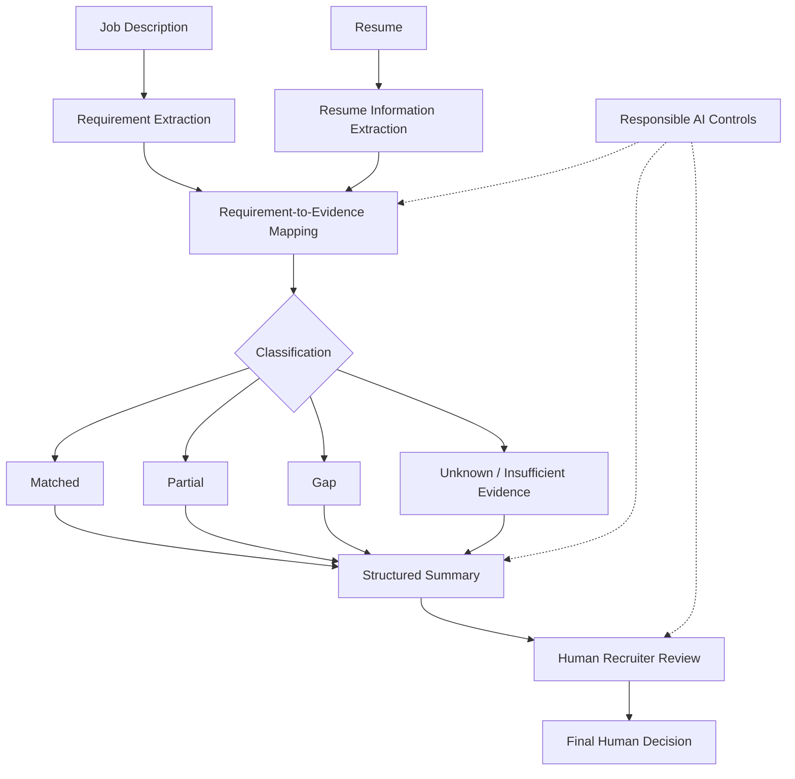

# Workflow Diagram

## Control Points
- Evidence must be traceable to supplied text.
- Unknown is used when evidence is missing or ambiguous.
- Irrelevant personal attributes are excluded from suitability assessment.
- Human review is mandatory.
- The AI cannot accept/reject a candidate.
